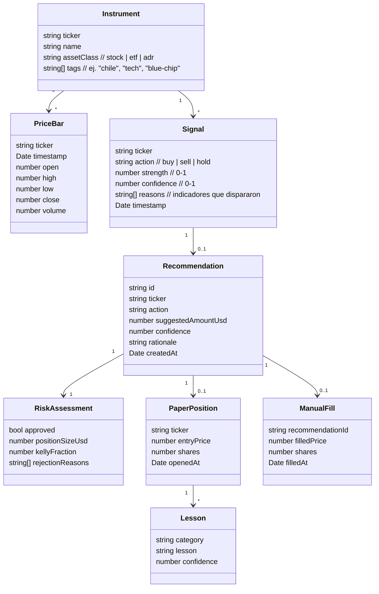

# Wall Street Wolf — SPDD REASONS Canvas

> Documento de diseño maestro (vivo). Metodología: **SPDD** (Structured Prompt-Driven Development).
> Regla de oro: **cuando la realidad diverge del diseño, primero se arregla este documento, después el código.**
>
> Última actualización: 2026-05-30

---

## Contexto en una frase

Sistema **semi-automatizado de señales** que vigila acciones/ETF de EE.UU. comprables en **Fintual**,
detecta oportunidades con análisis técnico barato (+ un toque puntual de LLM), y **te avisa por WhatsApp**
qué comprar/vender. **Tú ejecutas manual en Fintual.** Empezamos en **paper trading** hasta validar.

---

## R — Requirements (qué y por qué)

**Objetivo de negocio:** ayudar al usuario a tomar mejores decisiones de inversión en acciones/ETF de EE.UU.
(incluida exposición a empresas chilenas vía ADRs/ECH), con disciplina y gestión de riesgo, sin requerir
tiempo diario de su parte.

**Requisitos funcionales**
- Vigilar un universo amplio de acciones/ETF líquidos de EE.UU. comprables en Fintual.
- Generar señales accionables: `instrumento`, `acción (comprar/vender/mantener)`, `tamaño sugerido`, `razón`, `confianza`.
- Notificar al usuario por **WhatsApp** (canal desacoplado, intercambiable).
- Registrar cada señal y su resultado en un **ledger paper** para validar antes de plata real.
- Backtest honesto sobre histórico (sin lookahead) que reporte métricas reales.
- Aprender de los resultados (loop compound) y mejorar.

**Requisitos no funcionales**
- **Costo LLM mínimo**: técnico primero ($0); LLM solo en las 1-3 mejores candidatas (Haiku). Cap diario de costo.
- **Baja frecuencia**: ≤ ~10 señales ejecutables/mes (Fintual da 10 órdenes gratis/mes; después 0,1%).
- Semi-automatizado: el sistema sugiere, el humano ejecuta. **Sin ejecución automática de órdenes.**
- Seguro por defecto: paper hasta validar, kill-switch, sin secretos en el repo.

**Fuera de alcance (por ahora)**
- Ejecución automática en cualquier broker.
- Acciones de la Bolsa de Santiago directas (Fintual no las ofrece; se cubre vía ADRs/ECH en EE.UU.).
- Day-trading / alta frecuencia.

---

## E — Entities (modelo de dominio)



**Reuso de tipos existentes** (`src/shared/types.ts`): `RiskAssessment`, `RiskCheck`, `PerformanceMetrics`,
`ResearchBrief`, `SourceItem`, `Lesson` (compound). Se introducen `Instrument`, `PriceBar`, `Signal`,
`Recommendation`, `PaperPosition`, `ManualFill` y se deprecan los binarios de prediction-market
(`Market`, `MarketSignal`, `TradeOrder`/`TradeResult` de ejecución automática).

---

## A — Approach (estrategia y trade-offs)

1. **Motor de señales técnico-primero** (costo $0): RSI, MACD, cruces de medias, momentum, volatilidad,
   sobre datos de Alpaca (gratis). Reusa `src/indicators/`.
2. **Gate de LLM barato y selectivo**: solo las 1-3 mejores candidatas pasan por **1 llamada Haiku** que
   revisa noticias recientes y descarta trampas obvias. Reusa `src/research/`. Cap de costo diario.
3. **Riesgo y sizing**: reusa `src/risk/` (Kelly fraccional, guardas). Sizing pensado para Fintual
   (montos en USD, fracciones permitidas, mínimo US$1).
4. **Notificación desacoplada** (`notify/`): interfaz `Notifier` → impl. WhatsApp (Twilio sandbox en paper,
   Meta Cloud API en prod). Cambiar de canal no toca el resto.
5. **Ledger paper + backtest honesto**: registrar cada recomendación y precio; backtest walk-forward sin
   lookahead; métricas reales (win rate, Sharpe, calibración, max drawdown).
6. **Compound/learning**: reusa `src/compound/` para clasificar fallas y destilar lecciones.

**Trade-offs**
- Técnico-primero vs IA-primero → elegimos técnico por costo; la IA solo filtra, no decide sola.
- Universo amplio vs foco Chile → amplio (más oportunidades/liquidez); tags marcan los chilenos.
- Twilio sandbox vs Cloud API → sandbox por velocidad en paper; abstracción permite migrar.

---

## S — Structure (arquitectura de módulos)

```
src/
  universe/     ➕ define y filtra el universo de tickers (Fintual-compatible)
  data/         ➕ Alpaca SOLO datos (precios/klines/históricos) — sin ejecución
  signals/      ➕ motor de señales técnico + gate LLM selectivo
  research/     ♻️ reuso (noticias/sentimiento barato)
  risk/         ♻️ reuso (Kelly, guardas, sizing)
  notify/       ➕ interfaz Notifier + impl WhatsApp (Twilio→Cloud API)
  ledger/       ➕ registro paper de recomendaciones, fills manuales y posiciones
  backtest/     ➕ walk-forward honesto + métricas
  compound/     ♻️ reuso (aprendizaje, lecciones)
  shared/       ♻️ tipos, config, logger, utils
  orchestrator.ts  🔄 reescrito: Universe→Data→Signals→Risk→Notify→Ledger
  index.ts

ARCHIVAR (no aplica al nuevo enfoque):
  src/execution/   ❌ brokers automáticos (Polymarket/Kalshi/Binance/Alpaca-trade)
  src/scanner/     ❌ scanner de mercados de predicción (se reemplaza por universe/ + data/)
  src/prediction/  🔄 se simplifica: ensemble 5 LLM → técnico + 1 Haiku
```

---

## O — Operations (tareas ordenadas → outcomes de GitHub)

Ver milestones/issues en GitHub. Resumen por outcome:

- **Outcome 1 — "Veo señales paper de calidad en mi celular"**
  universe → data (Alpaca solo-datos) → signals (técnico) → notify (WhatsApp) → ledger paper
- **Outcome 2 — "Confío en las señales"**
  backtest walk-forward honesto + métricas + calibración + reporte
- **Outcome 3 — "Opero plata real chica con disciplina"**
  sizing Fintual + registro de fill manual + control de costo de órdenes (≤10/mes)
- **Outcome 4 — "El sistema aprende solo"**
  loop compound + review semanal automático + ajuste de parámetros

---

## N — Norms (estándares)

- TypeScript estricto; archivos **< 500 líneas**.
- **TDD London** (mock-first) para código nuevo; tests en `/tests`.
- Event-sourcing para cambios de estado (ledger).
- Validación de input en los bordes; sanitizar contenido externo (anti prompt-injection en research).
- Sin archivos de trabajo en la raíz; docs en `/docs`, scripts en `/scripts`.
- `npm run build` + `npm test` deben pasar antes de mergear.

---

## S — Safeguards (restricciones y guardas)

- **Solo paper** hasta que el backtest + ledger validen edge real (criterio explícito a definir en Outcome 2).
- **Cap de costo LLM** diario; el técnico nunca depende de LLM para funcionar.
- **Tope de señales/semana** para respetar las 10 órdenes gratis/mes de Fintual y evitar overtrading.
- **Kill-switch** (`./STOP`) detiene todo.
- **Backtest sin lookahead** — prohibido usar datos futuros; walk-forward estricto.
- **Sin secretos en el repo**; todo por `.env` (ya en `.gitignore`).
- Las señales son **sugerencias**, no asesoría financiera; el humano decide y ejecuta.

---

## Glosario de instrumentos "sabor Chile" (ADRs/ETF en EE.UU.)

`SQM` (litio/química), `BSAC` (Santander Chile), `BCH` (Banco de Chile), `ENIC` (Enel Chile),
`CCU` (bebidas), `ECH` (iShares MSCI Chile ETF). Se etiquetan con tag `chile` en el universo.
